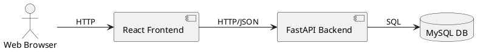
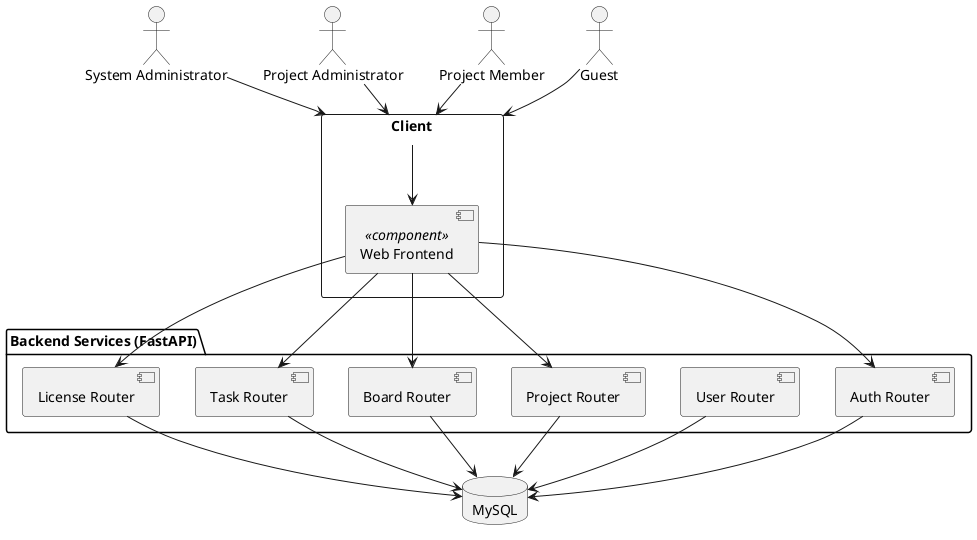
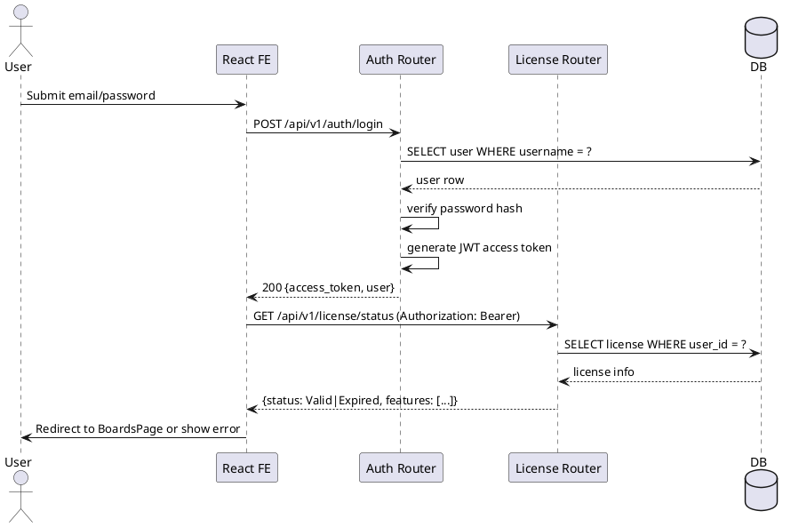
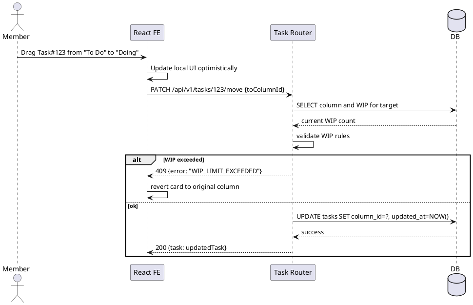

# **Software Design and Implementation Documentation**

Project Name: Kanban-Based Web Application  
Document Version: 2.0  
Date: YYYY-MM-DD  
Group ID: 22
Authors: Leanna Fowler, Yanice Kwon, Yiming Zhao   

\---

# **1\. Introduction**


## **1.1 Purpose**  

This Design and Implementation Document (FastAPI + MySQL version) describes the final architecture and implementation of the Kanban-Based Project Management System where the backend is fully implemented using FastAPI and MySQL. It is written for developers and course markers to understand how the system works end-to-end.

It explains:
* How the frontend, backend, and database interact
* Key components and services
* Data models, schemas, and API endpoints
* Design decisions, trade-offs, and known limitations

## **1.2 Scope**  
The implemented system includes:

* React-based frontend with routing and authentication
* FastAPI backend with RESTful endpoints
* MySQL database for users, boards, columns, tasks, and licenses
* JWT-based authentication
* Licence key verification for protected features
* Persistent Kanban board (CRUD + drag-and-drop)

Out of scope / partially implemented:
* Advanced analytics (full CFD/burnup/burndown)
* Email notification integration
* Rich role-based permission model (beyond basic roles)

## **1.3 Definitions, Acronyms, and Abbreviations**  

### **1.3 Definitions, Acronyms, and Abbreviations**

| Term | Definition |
| ----- | ----- |
| **API** | Application Programming Interface – a set of endpoints that allow the frontend to communicate with the backend |
| **CRUD** | Create, Read, Update, Delete – the four basic operations of persistent storage |
| **MVC** | Model-View-Controller – an architectural pattern that separates data (Model), user interface (View), and business logic (Controller) |
| **ORM** | Object-Relational Mapping – a programming technique that converts data between incompatible type systems (e.g., Sequelize, Prisma) |
| **JWT** | JSON Web Token – a compact, URL-safe means of representing claims to be transferred between two parties (alternative to session-based auth) |
| **REST** | Representational State Transfer – an architectural style for designing networked applications using HTTP methods |
| **Session** | Server-side storage of user authentication state, typically referenced by a cookie sent to the client |
| **bcrypt** | A password-hashing function designed to be computationally expensive to resist brute-force attacks |
| **Middleware** | Software layer that sits between the request and response cycle, used for authentication, logging, etc. |
| **CORS** | Cross-Origin Resource Sharing – a security feature that controls which domains can access backend resources |
| **CSRF** | Cross-Site Request Forgery – an attack that tricks authenticated users into executing unwanted actions |
| **Foreign Key (FK)** | A database field that links one table to another, establishing relationships between entities |
| **Primary Key (PK)** | A unique identifier for a database record |
| **HTTP Methods** | GET (retrieve), POST (create), PUT (update), DELETE (remove), PATCH (partial update) |

# **2\. Overall System Architecture**

## **2.1 High-Level Architecture**
The system follows a standard three-tier web architecture:


**Frontend**
* Built in React
* Uses React Router for page navigation
* Uses an `AuthContext` to hold the logged-in user and JWT
* Communicates with backend through `fetch` (wrapped by `authClient` and `apiClient`)

**Backend**
* FastAPI application exposing `/api/v1/...` endpoints
* Routers: `auth`, `users`, `boards`, `tasks`, `license`
* Uses SQLAlchemy ORM for MySQL persistence
* Uses Pydantic models for request/response validation
* Issues and verifies JWT tokens for authentication

**Database (MySQL)**
* Persistent storage for:
  * Users
  * Projects/Boards
  * Columns
  * Tasks
  * Licence keys
  * (Optional) Audit logs

## 

## **2.2 Technology Stack Table**

| Layer | Technology | Purpose |
| ----- | ----- | ----- |
| Frontend | React 18, JSX | Component-based UI |
| Routing | React Router | Client-side page navigation |
| State | React Context API | Auth/user state |
| Styling | CSS (Kanban.css + auth) | Layout and visual styling |
| Backend | FastAPI | RESTful API server |
| Auth | JWT | User authentication and authorization |
| Database | MySQL 8 | Persistent storage |


### **2.3 Key Design Principles**
* **Separation of Concerns**
UI, API, and persistence are clearly separated. React is responsible for rendering and user interaction; FastAPI focuses on business logic and validation; MySQL handles persistence.

* **API-First Design**
API contracts were defined before integration, based on the requirements and UML use cases.

* **Stateless Backend**
Backend does not store session state in memory; instead, each request carries a JWT token.

* **Extensibility**
Entities such as Project, Board, and Task are designed so that more features (WIP limits, reports) can be added without breaking existing APIs.

# **3\. UML Diagrams**


## **3.1 Component Diagram (Logical)**  



### **3.2 Frontend Component Hierarchy**

```
App
├── Navbar
├── AuthContextProvider
└── Routes
├── LoginPage
├── RegisterPage
├── BoardsPage
│ ├── KanbanColumn × N
│ │ └── KanbanCard × M
│ └── (optional) BoardControls
└── (future) LicensePage, ReportsPage
```

### **3.3 Sequence Diagram — Login + Licence Check**

## **3.4 Sequence Diagram — Drag Task to New Column**  


# **4\. Detailed Component Design**

## **4.1 Frontend (React)**  
### 4.1.1 AuthContext
* Stores current user and JWT token
* Provides `login`, `logout`, and `handleAuthSuccess` functions
* Reads token from `localStorage` on app load to keep users logged in

### 4.1.2 authClient.js
* Wrapper around `fetch` for auth-related endpoints:
  * `loginUser(credentials)` calls `POST /api/v1/auth/login`
  * `registerUser(data)` calls `POST /api/v1/auth/register`
* Throws high-level JS errors with friendly messages

### 4.1.3 apiClient.js (General API)
* Attaches JWT token from `localStorage` to `Authorization` header
* Exposes helpers:
  * `getBoards()` → `GET /api/v1/boards`
  * `getBoardTasks(boardId)` → `GET /api/v1/boards/{id}/tasks`
  * `createTask(boardId, payload)` → `POST /api/v1/boards/{id}/tasks`
  * `updateTask(taskId, payload)` → `PATCH /api/v1/tasks/{id}`
  * `moveTask(taskId, toColumnId)` → `PATCH /api/v1/tasks/{id}/move`

### 4.1.4 LoginPage
* Controlled form for `email` and `password`
  * On submit, calls `loginUser`
* On success:
  * Stores `access_token` in localStorage
  * Calls `handleAuthSuccess` in `AuthContext`
  * Navigates to `/boards`

### 4.1.5 RegisterPage
* Similar to LoginPage, but calls `registerUser`
* Optionally sends `displayName`
* On success, behaves like login

### 4.1.6 BoardsPage
* Fetches boards and tasks from backend on mount:
  * `GET /api/v1/boards`
  * `GET /api/v1/boards/{boardId}/tasks`
* Maintains `tasks` state as array of task objects
* Passes column-specific filtered tasks to `KanbanColumn`
* On task update or move, calls backend then updates local state

### 4.1.7 KanbanColumn

* Receives:
  * `columnName`, `columnId`, `tasks`
  * callbacks: `addTask`, `moveTask`, `updateTask`, `deleteTask`
* Implements drag-and-drop event handlers connected to backend

### 4.1.8 KanbanCard
* Draggable task card
* Represents one `Task` row from DB
* Supports:
  * Toggle completion
  * Inline editing of title/description
  * Delete
  * Drag between columns

## **4.2 Backend (FastAPI)**  

### 4.2.1 Project Layout (Example)
```
backend/
├── app/
│ ├── main.py
│ ├── database.py
│ ├── models.py
│ ├── schemas.py
│ ├── auth/
│ │ ├── router.py
│ │ └── utils.py
│ ├── routers/
│ │ ├── users.py
│ │ ├── projects.py
│ │ ├── boards.py
│ │ ├── tasks.py
│ │ └── license.py
│ └── core/
│ ├── config.py
│ └── security.py
└── alembic/
```
### 4.2.2 main.py
* Creates FastAPI app
* Includes routers with prefix /api/v1
* Configures CORS (allows frontend origin)
* Dependency injection for DB sessions

### 4.2.3 Models (SQLAlchemy)
Simplified example:
``` py
class User(Base):
__tablename__ = "users"

id = Column(Integer, primary_key=True, index=True)
username = Column(String(255), unique=True, index=True, nullable=False)
password_hash = Column(String(255), nullable=False)
display_name = Column(String(255))
created_at = Column(DateTime, server_default=func.now())

class Project(Base):
__tablename__ = "projects"
id = Column(Integer, primary_key=True)
name = Column(String(255), nullable=False)
owner_id = Column(Integer, ForeignKey("users.id"))

class Board(Base):
__tablename__ = "boards"
id = Column(Integer, primary_key=True)
name = Column(String(255), nullable=False)
project_id = Column(Integer, ForeignKey("projects.id"))

class Column(Base):
__tablename__ = "columns"
id = Column(Integer, primary_key=True)
name = Column(String(255), nullable=False)
wip_limit = Column(Integer, nullable=True)
board_id = Column(Integer, ForeignKey("boards.id"))

class Task(Base):
__tablename__ = "tasks"
id = Column(Integer, primary_key=True)
title = Column(String(255), nullable=False)
description = Column(Text)
column_id = Column(Integer, ForeignKey("columns.id"))
assignee_id = Column(Integer, ForeignKey("users.id"), nullable=True)
completed = Column(Boolean, default=False)
created_at = Column(DateTime, server_default=func.now())
updated_at = Column(DateTime, server_default=func.now(), onupdate=func.now())

class License(Base):
__tablename__ = "licenses"
id = Column(Integer, primary_key=True)
key = Column(String(64), unique=True, nullable=False)
owner_id = Column(Integer, ForeignKey("users.id"))
valid_until = Column(Date)
features = Column(String(255)) # comma-separated feature codes
```

### Schemas (Pydantic)
Example for tasks:
``` py
class TaskBase(BaseModel):
title: str
description: str | None = None

class TaskCreate(TaskBase):
column_id: int

class TaskUpdate(BaseModel):
title: str | None = None
description: str | None = None
completed: bool | None = None

class TaskOut(TaskBase):
id: int
column_id: int
completed: bool

class Config:
orm_mode = True
```

### 4.2.5 Auth Router
Key responsibilities:
* Register user: hash password, insert into DB
* Login: verify password, issue JWT
* Dependency to get `current_user` from token

Endpoints (under `/api/v1/auth`):
* `POST /register`
* `POST /login`

### 4.2.6 Task Router
**Endpoints:**
* `GET /boards/{board_id}/tasks` — Lists tasks for board
* `POST /boards/{board_id}/tasks` — Creates task
* `PATCH /tasks/{task_id} `— Updates title/description/completed
* `PATCH /tasks/{task_id}/move` — Moves task between columns with WIP check
* `DELETE /tasks/{task_id}` — Deletes task

**Each endpoint:**
* Requires current_user dependency (JWT)
* Validates board membership and license if feature-protected

### 4.2.7 License Router
**Endpoints:**
* POST /license/validate — Checks if a given key is valid
* GET /license/status — Returns license info for current user

**Logic:**
* Parse key in format AAAA-BBBB-CCCC-DDDD
* Look up in licenses table
* Check valid_until and enabled features


# **5\. Data Design**
## 5.1 Database Schema (MySQL)
Example DDL:
``` sql
CREATE TABLE users (
  id INT AUTO_INCREMENT PRIMARY KEY,
  username VARCHAR(255) UNIQUE NOT NULL,
  password_hash VARCHAR(255) NOT NULL,
  display_name VARCHAR(255),
  created_at TIMESTAMP DEFAULT CURRENT_TIMESTAMP
);

CREATE TABLE projects (
  id INT AUTO_INCREMENT PRIMARY KEY,
  name VARCHAR(255) NOT NULL,
  owner_id INT,
  FOREIGN KEY (owner_id) REFERENCES users(id)
);

CREATE TABLE boards (
  id INT AUTO_INCREMENT PRIMARY KEY,
  name VARCHAR(255) NOT NULL,
  project_id INT,
  FOREIGN KEY (project_id) REFERENCES projects(id)
);

CREATE TABLE columns (
  id INT AUTO_INCREMENT PRIMARY KEY,
  name VARCHAR(255) NOT NULL,
  wip_limit INT,
  board_id INT,
  FOREIGN KEY (board_id) REFERENCES boards(id)
);

CREATE TABLE tasks (
  id INT AUTO_INCREMENT PRIMARY KEY,
  title VARCHAR(255) NOT NULL,
  description TEXT,
  column_id INT,
  assignee_id INT,
  completed BOOLEAN DEFAULT FALSE,
  created_at TIMESTAMP DEFAULT CURRENT_TIMESTAMP,
  updated_at TIMESTAMP DEFAULT CURRENT_TIMESTAMP ON UPDATE CURRENT_TIMESTAMP,
  FOREIGN KEY (column_id) REFERENCES columns(id),
  FOREIGN KEY (assignee_id) REFERENCES users(id)
);

CREATE TABLE licenses (
  id INT AUTO_INCREMENT PRIMARY KEY,
  `key` VARCHAR(64) UNIQUE NOT NULL,
  owner_id INT,
  valid_until DATE,
  features VARCHAR(255),
  FOREIGN KEY (owner_id) REFERENCES users(id)
);
```
## 5.2 Entity Relationships
* One `User` can own many `Projects`
* One `Project` has many `Boards`
* One `Board` has many `Columns`
* One `Column` has many `Tasks`
* One `User` may own one or more `Licenses`

# **6\. API Design**  
## 6.1 Authentication
**POST `/api/v1/auth/register`**
* Register:
``` json
{
  "username": "testuser",
  "password": "secret",
  "display_name": "Test User"
}
```
* Response:
``` json
{
  "access_token": "...",
  "token_type": "bearer",
  "user": {"id": 1, "username": "testuser", "display_name": "Test User"}
}
```
**POST `/api/v1/auth/login`**
* Register:
``` json
{
"username": "testuser",
"password": "secret"
}
```
* Response: same shape as Register

## 6.2 Boards & Columns
**GET `/api/v1/boards`**
Returns all boards visible to the current user.

**GET `/api/v1/boards/{board_id}/columns`**
Returns columns for a board, including WIP limits.

## 6.3 Tasks
**GET `/api/v1/boards/{board_id}/tasks`**
Returns tasks grouped by columns.

**POST `/api/v1/boards/{board_id}/tasks`**
Creates a new task in a column.

**PATCH `/api/v1/tasks/{task_id}`**
Updates basic fields like title, description, completed.

**PATCH `/api/v1/tasks/{task_id}/move`**
* Request:
``` json
{
  "toColumnId": 3
}
```
* Response (Success):
``` json
{
  "task": {"id": 123, "column_id": 3, "completed": false}
}
```
* Response (WIP exceeded):
``` json
{
  "error": "WIP_LIMIT_EXCEEDED",
  "message": "Target column limit is 5, current is 5"
}
```

## 6.4 Licence
**POST `/api/v1/license/validate`**
Validates a license key.

**GET `/api/v1/license/status`**
Checks current user’s licence status and enabled features.

# **7\. Implementation Details**
## 7.1 Security & JWT
* Passwords hashed using `bcrypt`
* JWT includes user id and expiry
* Protected endpoints require `Authorization: Bearer <token>`
* FastAPI dependency verifies token and returns `current_user`

## 7.2 Error Handling
* Uses HTTP status codes: 200, 201, 400, 401, 403, 404, 409, 500
* Errors returned in JSON shape: `{ "error": "ERROR_CODE", "message": "..." }`

## 7.3 Frontend–Backend Integration
* `authClient.js` and `apiClient.js` centralize API calls
* `AuthContext` reads and writes token from/to `localStorage`
* `BoardsPage` uses `useEffect` to fetch tasks and then updates local state

## 7.4 Drag-and-Drop with Backend
* Frontend updates UI optimistically when dragging
* Sends `PATCH /tasks/{id}/move` to backend
* On error (e.g., WIP exceeded), reverts UI

# **8\. Development Methodology**
## 8.1 Process
* Iterative, agile-inspired development
* Milestones:
  * M1: Requirements & UML
  * M2: Frontend skeleton
  * M3: Auth backend
  * M4: Task/board backend integration
  * M5: Licence and polishing

## 8.2 Version Control
* GitHub repository
* Feature branches for auth, boards, tasks, licence
* Pull requests and reviews where possible

# 9\. Known Issues & Limitations
* Licence logic is basic; does not yet enforce per-feature granularity everywhere
* Reporting endpoints only partially implemented
* Audit logging minimal
* No full test coverage for every endpoint

# 10\. Repository Links
* Frontend GitHub Repository:
*(Insert URL here)*
* Backend (FastAPI + MySQL) Repository:
*(Insert URL here)*

# 11\. Conclusion
