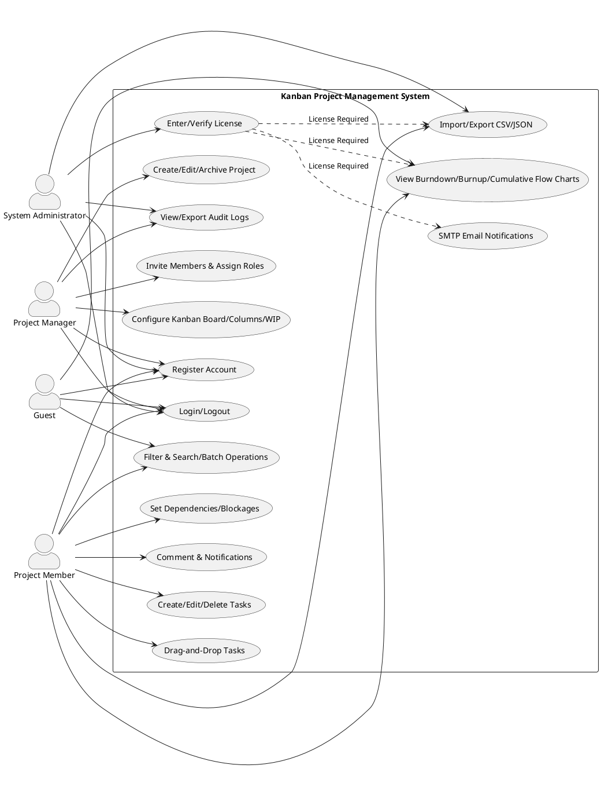
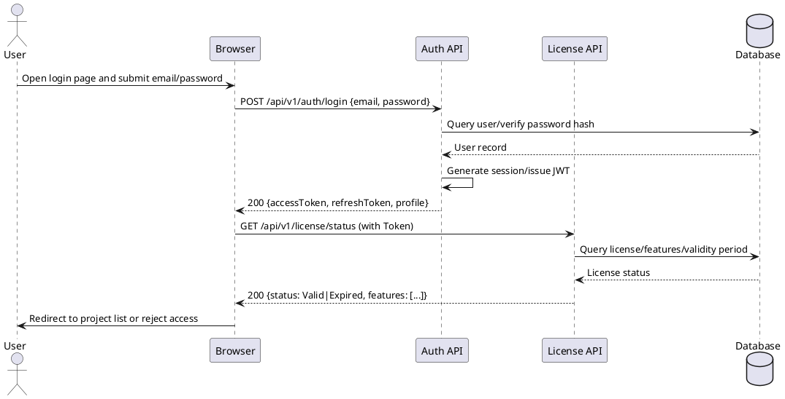
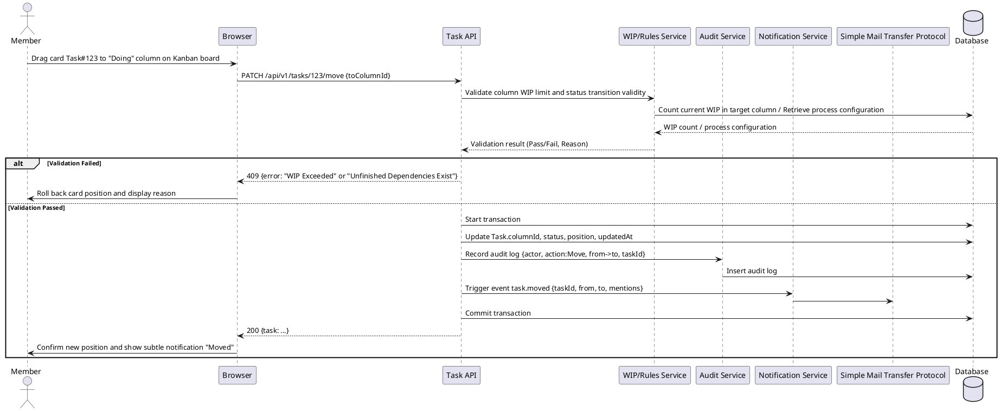
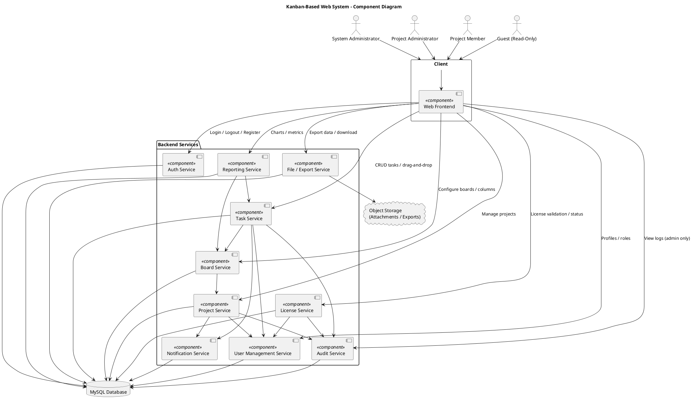

# Requirement Specification
## version 1.1
## Document Overview
### Purpose
This document defines the requirements for "Sprintfy" to provide a unified  reference for product, development, and testing teams. The document specifies the system’s functional requirements (FR), non-functional requirements (NFR), business  boundaries, key scenarios, and quality standards to ensure alignment between implementation and documentation.  
### Scope
#### System Boundaries
The system provides browser-based project and kanban management, to-do-list, license authentication.  
#### Core Value
Centered on a concise kanban interface, the system helps teams visualize work, limit work in progress, and then improve  delivery flow.  
### Role  
Leanna:Frontend, test document,implementation document.
Yanice:Frontend, implementation document.
Yiming:Backend,database,requirment spcification.
### Reference Materials  
GPT-5 (For document frame and translation from Chinese)  
---
## Background and Objectives  
### Problem Statement and Motivation
Teams face challenges such as unclear task assignment, we build a to-do list for teams or people to help them plan and finish their tasks.
### Success Metrics
1.**Onboarding**: New users take ≤10 minutes from registration to successfully creating their first kanban board and adding a task.  
2.**Usability**: Success rate of critical path tasks ≥ 98%.  
3.**Stability**: Error rate < 0.5%; end-to-end pass rate for key use cases ≥ 95%.  
---
## Stakeholders and User Personas  
### Stakeholder List
System Administrators: Maintain the system, manage licenses, view audit logs, and export data.
Project Members: Create/update tasks, collaborate via comments.
Guests : Need a license key to enter the website.
### User Personas
User A is a development member. He checks personal tasks daily, updates task status via drag-and-drop,.
### Scenarios
Login → View personal kanban boards → Handle upcoming tasks → Update task status via drag-and-drop  → View reports  → Logout
## Constraints and Assumptions  
### Technical Constraints
- Browsers: Supports Chrome/Firefox versions from the past 5 years; mobile devices use responsive design.
- Database: Uses a mysql database ; migration scripts are provided.
- Frameworks: Frontend React, Backend Python, REST API v1.  
### Operating Environment and Hardware
- Deployment: Supports Linux/Windows.
- Minimum Hardware: 4-core x86_64 2GHz CPU, 8GB RAM; no dedicated GPU required.
- Installation: Docker Compose or one-click scripts are provided for installation and startup.  
---
## System Scope and Context  
### System Context Description  
#### Human Actors
System Administrators, Members, Guests  
#### External Systems and Services
- Object Storage/File System: Stores attachments and exported files.
- This System:Frontend Web UI, Backend API Service, Database, License Authentication, Audit Logs
#### Boundary Description
- stored and send password in hashing way, ensuring the safety of users' information.
#### Context Diagram (Text Description)
Users access the Web UI via browsers over HTTP; the Web UI calls the backend REST API.
The backend accesses the database to store user, project, task, license,; it uses object storage to save attachments and exported files.
Administrators export audit logs and data backups via the admin interface.
---
## Functional Requirement  
### Category 1: Login and Security
1. Registration/Login/Logout
2. License Management
3. Database Storage of User Information
### Category 2: Progress Visualization
1. To-do-list
2. system Admin can generate license.
### Category 3: Features
1. dark-mode
---
## Non-Functional Requirement  
### Category 1: Consistency
1. Clear Division of Architectural Responsibilities
2. Scalability
3. Consistency in Design and Implementation
### Category 2: Database
1. Use of MySQL Database
2. Database Performance
3. Database Table Consistency
### Category 3: Human-Computer Interaction
1. Intuitive UI
2. Availability of Corresponding User Documentation
3. Accessibility
### Category 4: Account Security
1. Reliable License Verification Mechanism
2. Least Privilege Principle
3. Security Auditing
### Category 5: Performance Requirements
1. Short Response Time
2. Frontend Performance
### Category 6: Reliability & Maintainability
1. Operation Logs
2. Database Backup and Recovery Functions
3. Code Maintainability
###  Development Process
1. Traceability of Code Changes
2. Review of Submitted Modifications
---
## Use case diagram

## Sequence Diagram 1: Login and License Verification

## Sequence Diagram 2: Drag Task to New Column

## Components diagram
